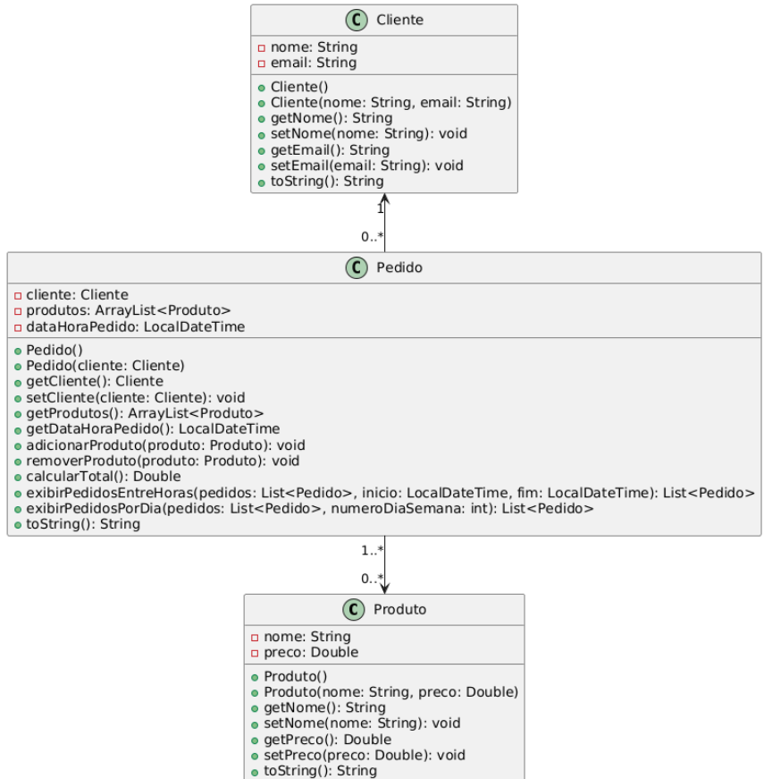

# Exercício Sistema de Loja 🛒

## Orientações Gerais 🚨
* Utilize apenas **tipos wrapper** para criar atributos e métodos quando possível.
* Respeite os nomes de atributos e métodos definidos no exercício.
* Tome cuidado com os argumentos especificados no exercício. Não adicione argumentos não solicitados e mantenha a ordem definida no enunciado.
* Verifique se não há erros de compilação no projeto antes de enviar.
* As classes devem seguir as regras de **encapsulamento**.
* Deixe um **construtor vazio** para utilização nos testes unitários.
* Utilize o `LocalDateTime` para registrar a data e hora dos pedidos.
* Utilize `toString()` para exibir informações das classes.

---

## Diagrama UML 📊

 

## Classes

### Produto

* Deve possuir todos os métodos getters e setters.
* Métodos:

  * mostrarInfo(): exibe nome e preço do produto.
* Construtores:

  * Produto() // vazio
  * Produto(nome: String, preco: Double) // com parâmetros

### Cliente

* Deve possuir todos os métodos getters e setters.
* Construtores:

  * Cliente() // vazio
  * Cliente(nome: String, email: String) // com parâmetros

### Pedido

* Deve possuir todos os métodos getters e setters, exceto setter da lista de produtos.
* Atributos:

  * cliente: Cliente (associação)
  * produtos: ArrayList<Produto> (agregação)
* Métodos:

  * adicionarProduto(Produto produto): adiciona um produto à lista.
  * removerProduto(Produto produto): remove um produto da lista.
  * calcularTotal(): Double — soma todos os preços dos produtos.
  * mostrarPedido(): exibe informações do cliente e lista de produtos.

## Relacionamentos

* Pedido → Cliente: Associação (um pedido pertence a um cliente)
* Pedido → Produto: Agregação (um pedido contém produtos)

## Atividade

1. Crie produtos e adicione atributos relevantes.
2. Cadastre clientes.
3. Crie pedidos associando cada pedido a um cliente.
4. Adicione produtos ao pedido usando adicionarProduto().
5. Remova produtos quando necessário.
6. Exiba o pedido completo com mostrarPedido().
7. Calcule o total do pedido com calcularTotal().

**Objetivo:** Demonstrar POO, construtores, encapsulamento, ArrayList e relacionamentos em um único sistema funcional.
